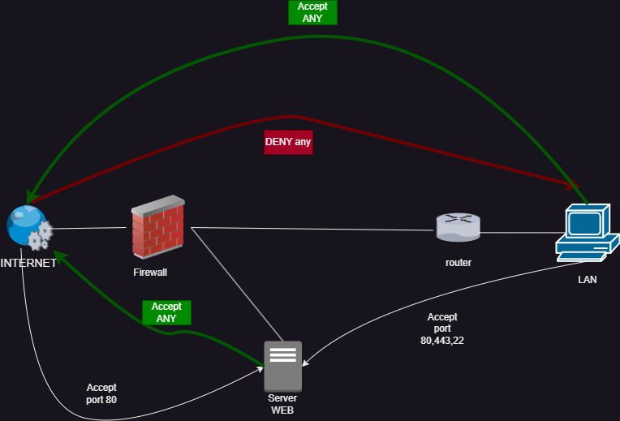

# Projet : Mise en place d’un Firewall et durcissement d’un serveur Web

## 🎯 Objectifs
- **Installer un firewall** pour filtrer les flux de données et protéger le réseau local.
- **Durcir le serveur Web Nginx** pour réduire les failles de sécurité.
- **Mettre en place une DMZ** (zone démilitarisée) pour renforcer la sécurité réseau.

  

## 🛠️ Environnement et Prérequis
- **VM Debian** avec **Vagrant** pour gérer les machines virtuelles.
- Utilisation de **ufw** (Uncomplicated Firewall) pour configurer le firewall.
- **Test de pénétration** avec des outils comme **nmap** pour valider l'efficacité des sécurisations.

  

## 📋 Modalités pratiques
- Durée du projet : **2 semaines**.
- Travail en **équipe de 2**.


    
## 📝 Etapes du Travail
1. **Création des VMs** avec Vagrant (2 VMs : serveur et client).
2. **Installation de Nginx** et du **firewall** sur le serveur.
3. **Tests manuels** pour vérifier la configuration.
4. **Sécurisation du serveur** en appliquant des configurations renforcées avec `ufw`.
5. **Création de scripts** pour automatiser la configuration du firewall et tester les règles de sécurité.

   

## 🔥 Les différents service de firewall
  
| NOM| `iptables` | `firewalld` | `ufw` |
|---------------------- |------------|------------|------|
| **Facilité d’utilisation** | ❌ Complexe (commandes longues) | ✅ Simple (zones et services) | ✅ Très simple (commandes courtes) |
| **Dynamisme** | ❌ Statique (redémarrage requis) | ✅ Dynamique (modifications à chaud) | ❌ Nécessite un rechargement |
| **Performance** | ✅ Rapide et léger | ❌ Légèrement plus gourmand | ✅ Léger et efficace |
| **Flexibilité** | ✅ Très configurable | ❌ Moins adapté aux besoins avancés | ❌ Moins flexible qu’`iptables` |
| **Gestion des règles** | ❌ Moins intuitif | ✅ Plus clair grâce aux zones | ✅ Facile grâce à une syntaxe simplifiée |
| **Compatibilité** | ✅ Supporté par toutes les distributions | ✅ Par défaut sur RHEL, CentOS, Fedora | ✅ Disponible sur Debian, Ubuntu (par défaut) |


## 🛡️ Sécurisation du serveur **Nginx** : 

### 1️⃣ Failles applicatives  
- **XSS (Cross-Site Scripting)** : Injection de scripts malveillants.  
- **Faille des inclusions de fichiers** : Accès non autorisé via SSH ou autre.  

### 2️⃣ Failles systèmes & configurations  
- **Mauvaise config serveur** : Ports ouverts, permissions mal définies…  
- **Failles Zero-Day** : Vulnérabilités exploitées avant correctif.  
- **Mise à jour manquante** : Systèmes obsolètes non patchés.  

### 3️⃣ Failles réseau & attaques  
- **MITM (Man-in-the-Middle)** : Interception des communications.  
- **Phishing** : Tromperie pour voler des infos sensibles.  
- **DDoS** : Saturation d’un serveur pour le rendre indisponible.  

## ⚙️ Outils Utilisés
- **Vagrant** : Création et gestion des VMs.
- **VirtualBox** : permet la virtualisation.
- **ufw** : Configuration du firewall.
- **iptables** : ufw se base dessus.
- **nmap** : Outil de test de sécurité.
- **ab** : Outil pour exécuter un gros nombre de requête.
- **Nginx** : Serveur web.

## Structure du projet

Les dossiers sont organisés de la façon suivante : 
````.
├── README.md
├── doc_util
│   ├── info_VB.txt
│   ├── lien_web.txt
│   └── network.png
├── sae_Firewall
│   ├── client
│   │   ├── DDOS.sh
│   │   ├── test.sh
│   │   └── Vagrantfile
│   ├── DMZ
│   │   ├── set-up-ufw-dmz.sh
│   │   ├── test.sh
│   │   └── Vagrantfile
│   ├── INTERNET
│   │   ├── DDOS.sh
│   │   ├── test.sh
│   │   └── Vagrantfile
│   ├── router
│   │   ├── test.sh
│   │   └── Vagrantfile
│   └── server
│       ├── avail.txt
│       ├── DDOS.txt
│       ├── index.html
│       ├── nginxconf.txt
│       ├── test.sh
│       └── Vagrantfile
├── scripts
│   ├── construct-vm.sh
│   ├── info_command.txt
│   └── manage-firewall.sh
├── suivi
│   └── journal-de-bord.md
└── vagrant
    └── Vagrantfile.
````

Nous avons choisi de créer un Vagrantfile par machine afin d'avoir un visiblité par machine.

## Mise en place des VMs
### Linux
#### prérequis
Avoir d'installé le paquet `virtual box` et `vagrant` sur la machine.

#### lancement des VMs
un script bash `construct-vm.sh` est disponnible pour lancer toute les VM au chemin suivant : `demo-firewall\scripts\construct-vm.sh`.

### Windows
#### prérequis
installer le paquet [Vagrant](https://developer.hashicorp.com/vagrant/install?product_intent=vagrant "Vagrant").

#### start
vous devrez vous déplacer sur chaque dossier de VM pour executer un `vagrant up`

## Début des tests
Sur chaque machine, nous avons implémenté un script qui effectue des tests dans `/tmp` qui se nomme `test.sh`,celui-ci effectue des tests différents en fonction des machines.

Nous avons également effectué un test de DDOS depuis `INTERNET` et `Client` qui utilise le paquet `ab`

## Sécurisation
Nous avons de la sécurité appliqué principalement sur la machine DMZ avec `ufw` en filtrant les flux :



Un script `manage-firewall.sh` est disponible sur `/tmp/manage-firewall.sh` pour le serveur, celui-ci permet une administration simple d'ufw, sans avoir besoin de connaitre les commandes.


## 📂 Livrables
- Scripts de configuration des VMs.
- Scripts de démonstration du firewall.
- Journal de travail détaillant les étapes réalisées.
